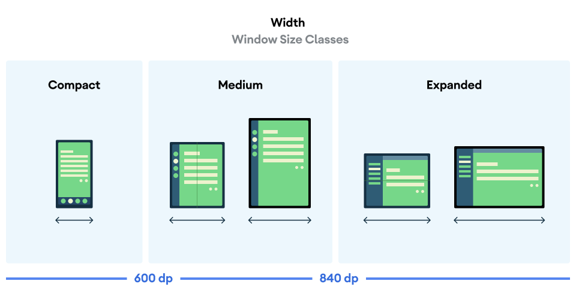
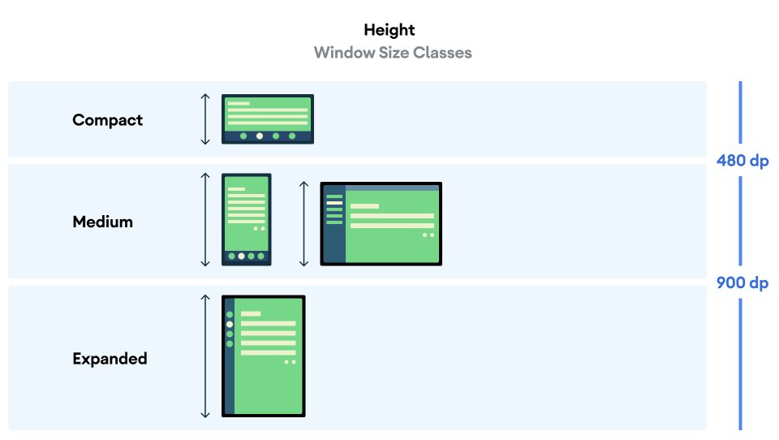

Adaptive layout -> 3 pre-defined window classes are implemented by google known as Window size classes. 

As you design your app and decide where to place interactive UI elements in your layout, consider the ergonomic implications of different regions of the screen.

Which areas are comfortable to reach while holding the device?
Which areas can be reached only by extending fingers, which may be inconvenient?
Which areas are challenging to reach or are far away from where the user holds the device?

